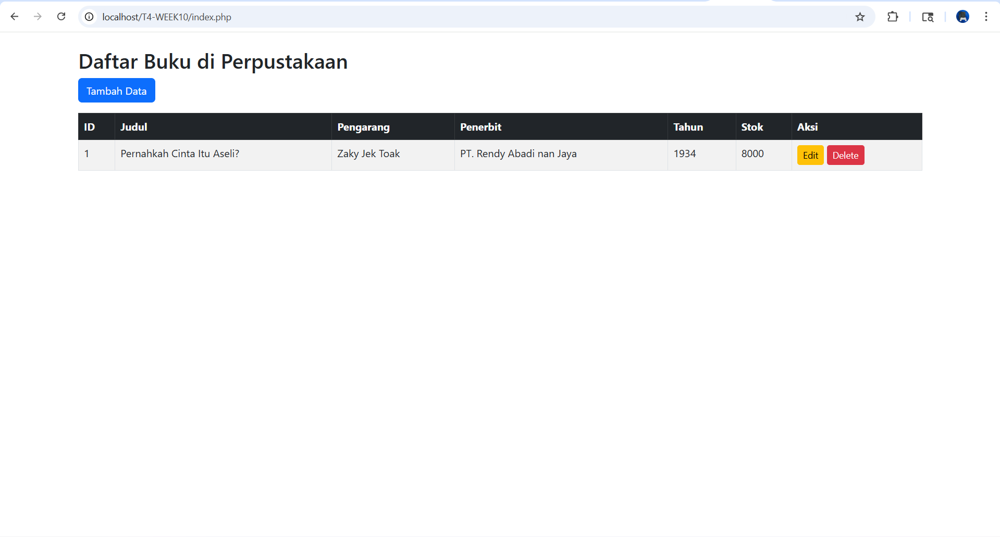
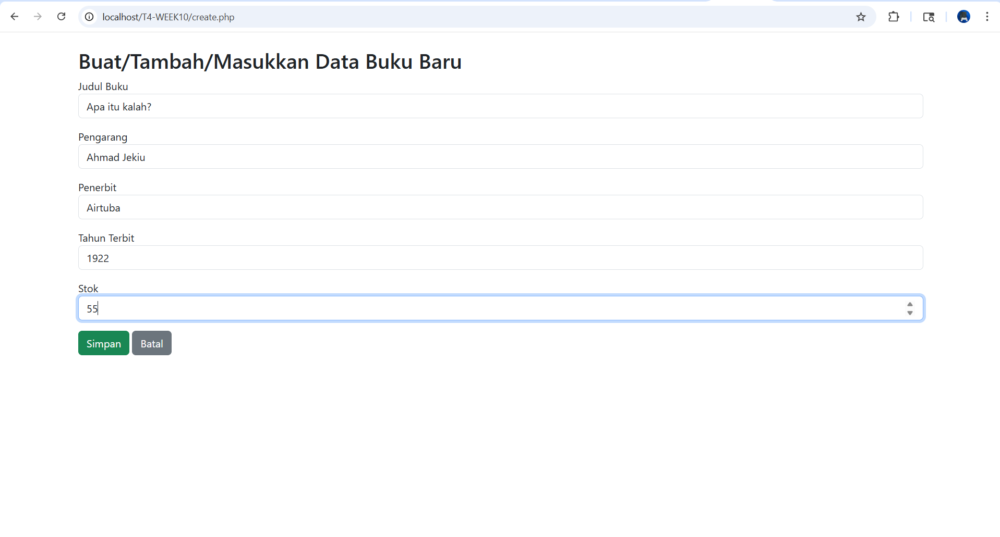
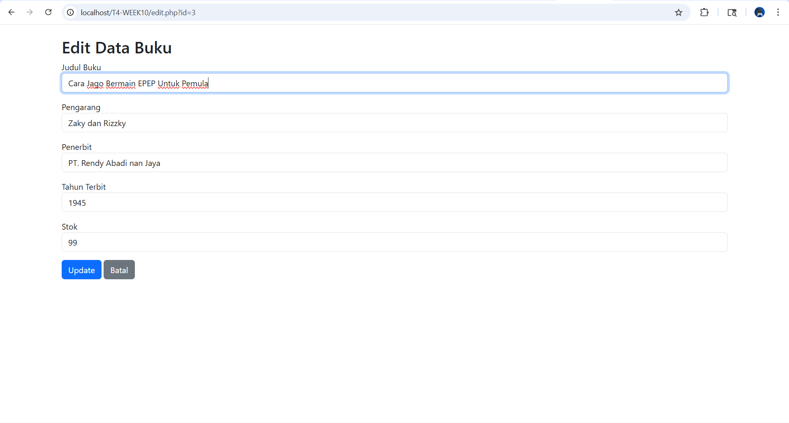
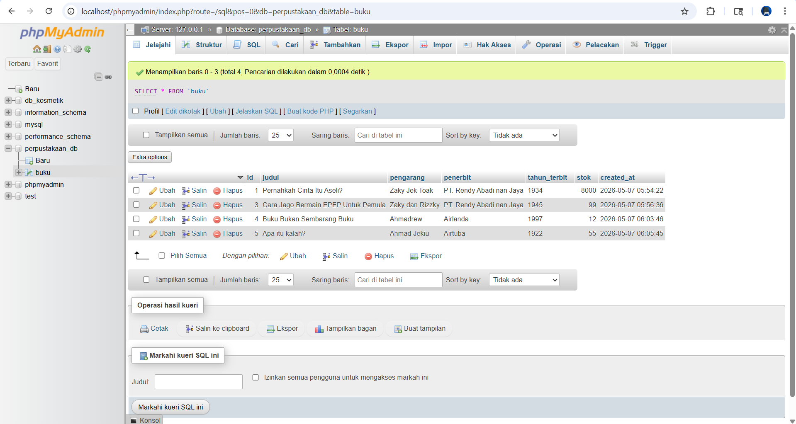

# T4-WEEK10
Tugas CRUD-PHP Rendy Wahyu Islami (F1D02410133)

# T4-WEEK10 - CRUD PHP MySQL

Nama  : Rendy Wahyu Islami
NIM   : F1D02410133
Kelas : Pemrograman Web

## Deskripsi
Aplikasi CRUD (Create, Read, Update, Delete) menggunakan PHP Native dan MySQL dengan implementasi keamanan (Prepared Statement dan `htmlspecialchars`).

- Database : perpustakaan_db
- Tabel    : buku

## Cara Menjalankan
1. Import file `perpustakaan_db.sql` ke phpMyAdmin.
2. Letakkan folder project di `htdocs/` (bagi pengguna XAMPP, bagi pengguna laragon silahkan mecari tutorial di yt/gugel).
3. Buat folder bernama T4-WEEK10
4. Atau clone repo ini di folder project di `htdocs/`
5. Sesuaikan apa yang perlu di sesuaikan
6. Buka browser ke http://localhost/T4-WEEK10/

## Screenshot

### Daftar Data

### Tambah Data

### Edit Data

### Struktur Database (phpMyAdmin)

